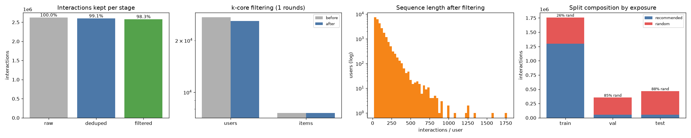
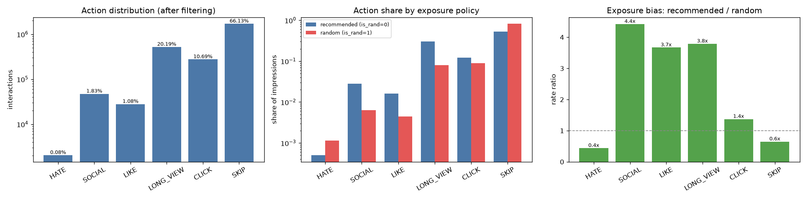

<a name="readme-top"></a>


## About The Project

**Generative Sequential Recommendation: Meta HSTU on KuaiRand Short-Video Logs**

This project adapts Meta's official **HSTU** encoder (Hierarchical Sequential Transduction Units; Zhai et al., 2024) to [KuaiRand](https://kuairand.com/) — a Kuaishou impression log that records both production recommendations and randomly exposed videos:

- **Stage 0–1 — Industrial log pipeline**: merge recommended + random-exposure streams, collapse 8 overlapping feedback flags into 7 action classes, k-core filter, temporal split with an independent leakage auditor.
- **Stage 2–3 — Generative retrieval**: interleaved item + action tokens into official HSTU; next-item prediction under a dual-stream protocol (train on recommended, evaluate both).
- **Stage 5 — Capacity sweep**: named sizes from 0.56M to 7.3M parameters; test NDCG@10 peaks at 4.7M and drops at 7.3M.

The interesting part is not a toy MovieLens clone. Production logs are **chosen by the old policy**. KuaiRand's random arm is the recsys cousin of an incrementality holdout. The project treats that as a measurement problem: one user timeline, an `is_rand` flag, masks at read time — not two fake datasets.

**Key Results (test, recommended stream, full-catalogue ranking, 7,582 items)**

| System | Recall@10 | NDCG@10 |
|---|---|---|
| Chance (uniform) | 0.0013 | 0.0006 |
| Popularity baseline | 0.0302 | 0.0155 |
| HSTU-small (0.56M) | 0.0523 | 0.0246 |
| HSTU-base (1.37M) | 0.0595 | 0.0285 |
| **HSTU-large (4.7M)** | **0.0640** | **0.0308** |
| HSTU-xlarge (7.3M) | 0.0597 | 0.0291 |

**HSTU-large is 2.0× popularity on NDCG@10.** The random-exposure stream sits at chance (~0.0009 Recall@10) for every size — a negative control for next-item identity, not a second quality score.

**Core Features:**

- **Official HSTU encoder** — Meta `generative-recommenders` research path, not a from-scratch clone of the paper's fused kernels
- **Multi-behavior tokens** — item + 7-class action interleaved (`HATE` / `SOCIAL` / `LIKE` / `LONG_VIEW` / `CLICK` / `SKIP` + `PAD`)
- **Relative time bias** — official bucketed `log(|t_j − t_i|)` attention bias
- **Dual-stream protocol** — train on `is_rand=0`; headline eval on recommended; random stream as a leak detector
- **Temporal split** — global cutoff (last 4 days test, 3 days val); leave-one-out exists and reports its leakage
- **Independent auditor** — `data.verify` re-derives guarantees from written pickles; adversarially tested
- **Full-catalogue ranking** — Recall@K / NDCG@K / MRR plus popularity and chance baselines
- **Size ladder** — `tiny` → `xlarge` presets for a capacity sweep
- **Colab + Drive resume** — A100 training, atomic checkpoints, epoch-granular auto-resume

**Cloud Training:** Trained on Google Colab using an **NVIDIA A100 40GB**. HSTU-large (the headline checkpoint) plus the small / base / xlarge sweep completed in one session with Drive-backed checkpoints.


**Pipeline Overview:**



**Action distribution (recommended vs random exposure):**



I hope this project demonstrates a clean, end-to-end ML engineering pipeline — from a biased production log to a protocol you can defend — including why the metric you pick decides the conclusion. Fight on! ✌️

<p align="right">(<a href="#readme-top">back to top</a>)</p>

### Built With

* Python
* PyTorch
* KuaiRand-Pure
* Meta HSTU (`generative-recommenders`)
* Pandas / PyArrow
* TensorBoard
* Google Colab (A100)

<p align="right">(<a href="#readme-top">back to top</a>)</p>


## Project Structure

```sh
hstu-shortvideo-rec/
├── pictures/
│   ├── stage0_overview_standard.png
│   ├── stage0_overview_random.png
│   ├── stage1_action_distribution.png
│   └── stage1_pipeline.png
│
├── data/
│   ├── download.py                    # fetch KuaiRand-Pure / 1K / 27K from Zenodo
│   ├── schema.py                      # dtypes, required fields, click / long_view rules
│   ├── loader.py                      # CSV globs + parquet cache
│   ├── stats.py                       # Stage 0 profile
│   ├── explore.py                     # Stage 0 entry
│   ├── actions.py                     # 8 flags → 7 discrete action classes
│   ├── exposure.py                    # is_rand bookkeeping + bias ratios
│   ├── filtering.py                   # iterative k-core
│   ├── splitting.py                   # temporal / LOO + leakage report
│   ├── encoders.py                    # dense IDs, PAD/UNK, train-only item fit
│   ├── sequences.py                   # per-user records + is_target mask
│   ├── protocol.py                    # TRAIN_STREAM / EVAL_STREAMS / target_mask
│   ├── preprocess.py                  # Stage 1 entry
│   └── verify.py                      # independent audit of written pickles
│
├── models/
│   ├── dataset.py                     # Stage 1 pkl → interleaved HSTU tensors
│   ├── hstu.py                        # official HSTU + item/action preprocessor
│   ├── smoke.py                       # Stage 2: one-batch forward / backward
│   ├── config.py                      # named sizes (tiny … xlarge)
│   ├── evaluate.py                    # full-catalogue metrics + baselines
│   └── train.py                       # Stage 3: AMP, ckpt, resume, eval
│
├── utils/
│   ├── check_env.py                   # python / torch / GPU
│   └── meta_repo.py                   # clone Meta repo + fbgemm fallback
│
├── visualization/
│   └── save_plots.py
│
├── colab/
│   ├── hstu_colab.ipynb               # Drive-backed driver: download → train
│   └── _build_notebook.py             # regenerates the notebook
│
├── datasets/                          # dumps (gitignored)
│   ├── raw/KuaiRand-Pure/
│   └── processed/
├── runs/                              # checkpoints, tb, metrics (gitignored)
├── third_party/                       # Meta clone (gitignored)
├── requirements.txt
└── README.md
```

Scripts hold the logic. The notebook is only a driver, so the same `python -m` path runs locally and on Colab.

<p align="right">(<a href="#readme-top">back to top</a>)</p>


## System Architecture

**Data Pipeline**

1. **Download**: KuaiRand-Pure from Zenodo (md5-verified). 1K / 27K via `--dataset`.
2. **Merge**: concatenate `log_standard` + `log_random`; assert zero shared `(user_id, video_id, time_ms)`.
3. **Dedupe**: drop byte-duplicate impressions; keep legitimate re-exposures at different times.
4. **Encode**: priority ladder → one action id per impression; keep raw flags in parquet.
5. **Filter**: iterative k-core (`min_user_len=20`, `min_item_count=10`).
6. **Split**: global temporal cut (train / 3-day val / 4-day test). Item encoder fit on **train only**.
7. **Sequences**: full chronological history + `is_target` + `is_rand`. Stream selected later by mask.

**Model Pipeline**

1. **Interleave**: `[item_0, action_0, item_1, action_1, …]` (256 impressions → 512 tokens).
2. **HSTU stack**: official encoder, relative time + position bias, per-head dim 32.
3. **Loss**: next-item CE on recommended targets only. Full softmax over ~7.6k items (sampled softmax is the 1K/27K knob).
4. **Ranking**: query at position *i* scores the full catalogue for item *i+1*. PAD / UNK excluded.

**Inference / eval pipeline**

1. Load `best.pt`, rebuild the same window the encoder was trained with.
2. `target_mask(record, "recommended")` and `target_mask(record, "random")`.
3. Full-catalogue ranks → Recall@K, NDCG@K, MRR; popularity and chance on the same targets.
4. Coverage printed next to every metric (targets dropped by left-truncation).

There is no serving API in this repo. Offline eval is `models.evaluate`.

**Data Flow**

```
KuaiRand-Pure (log_standard_*.csv + log_random_*.csv)
    ↓
Merge + dedupe + action encode + k-core + temporal split
    ↓
{train,val,test}_seqs.pkl  (items, actions, timestamps, is_rand, is_target)
    ↓
KuaiRandSequenceDataset  (truncate 256, protocol mask)
    ↓
CombinedItemAndActionPreprocessor  (interleave + pos emb)
    ↓
Official HSTU (rel-bias attention × N blocks)     ── generative encoder
    ↓
Next-item softmax over catalogue (recommended positions only)
    ↓
Full-catalogue rank on val/test
    ├── recommended  → headline (A/B-like mix)
    └── random       → negative control (expect chance)
```

<p align="right">(<a href="#readme-top">back to top</a>)</p>


## Architecture Components

**Action taxonomy** (`data/actions.py`)

- Eight overlapping flags → seven classes. First match wins: `HATE` → `SOCIAL` → `LIKE` → `LONG_VIEW` → `CLICK` → `SKIP`.
- Positives nest in the real data (99.6% of `long_view` rows are also `is_click`). Hate is **not** “super engagement” (median play ratio 0.098) so it sits on top of the ladder instead of being swallowed.
- Author-directed flags (`follow` / `forward` / `comment` / `profile_enter`) share `SOCIAL` — each is too rare for its own embedding.

**Exposure bookkeeping** (`data/exposure.py`)

- Recommended vs random action-share ratios: `SOCIAL` 4.42×, `LONG_VIEW` 3.79×, `HATE` 0.44×.
- Random log only exists 2022-04-22 onward; a temporal split therefore trains at ~26% random and tests at ~88% random.

**Protocol** (`data/protocol.py`)

- `TRAIN_STREAM = "recommended"`, `EVAL_STREAMS = ("recommended", "random")`.
- `target_mask` never widens a split's own `is_target`. Preprocess stays `--target-policy all` so both evals come from one dump.
- The two streams are never averaged.

**HSTU wrapper** (`models/hstu.py`)

- Official `HSTU` + `CombinedItemAndActionPreprocessor`.
- Timestamps repeated on item and action tokens (no time passes between a view and its feedback).
- `next_item_loss` gathers marked positions before CE so PAD/UNK cannot produce `inf * 0` NaNs.
- `--num-negatives` switches to sampled softmax for larger catalogues.

**Dataset adapter** (`models/dataset.py`)

- Left-truncates to `--max-impressions`, applies the protocol mask, carries `is_rand` for per-stream metrics.
- Default window 256 covers 99.96% of recommended test targets.

**Training loop** (`models/train.py`)

- AdamW, cosine LR (Meta's ml-20m recipe used constant LR; cosine is for a fixed epoch budget).
- bf16 AMP on A100/L4, gradient clip, TensorBoard + `metrics.jsonl`.
- Atomic `last.pt` / `best.pt`. Resume is epoch-granular: weights restore, the interrupted epoch restarts from batch 0.
- Checkpoints fingerprint the Stage 1 config and refuse to load across a different vocab or split.

**Evaluation** (`models/evaluate.py`)

- Full catalogue, not sampled negatives. Repeat exposures stay in the candidate set (2.5% of pairs re-occur; a repeat is a legal next item).
- Popularity ranks from **train** counts only.

**Verifier** (`data/verify.py`)

- Prefix containment (train ⊂ val ⊂ test sequences), chronology, stream partition, optional `--deep` CSV round-trip.
- Sabotage tests: a no-op swap of duplicate items is not a failure; a real reversal is.

<p align="right">(<a href="#readme-top">back to top</a>)</p>


## Usage

**Prerequisites**

```bash
git clone https://github.com/rayzhao27/hstu-shortvideo-rec.git
cd hstu-shortvideo-rec
```

```bash
conda create -n hstu python=3.10
conda activate hstu
pip install -r requirements.txt
# install a CUDA torch wheel yourself if you are not on Colab
```

**Download and profile (Stage 0)**

```bash
python -m utils.check_env
python -m data.download
python -m data.explore
```

`data.explore` calls download if needed. Other releases: `--dataset KuaiRand-1K` or `KuaiRand-27K`.

**Build sequences (Stage 1)**

```bash
python -m data.preprocess
python -m data.verify
python -m data.protocol
```

**Smoke-test the official encoder (Stage 2)**

```bash
python -m utils.meta_repo          # clones into third_party/ (gitignored)
python -m models.smoke             # CPU is fine
python -m models.smoke --device cuda
```

**Train (Stage 3)**

```bash
python -m models.train \
  --size large \
  --processed-dir datasets/processed \
  --out-dir runs/large \
  --max-impressions 256 \
  --batch-size 64 \
  --epochs 20 \
  --lr 1e-3 \
  --weight-decay 0 \
  --dropout-rate 0.2 \
  --lr-schedule cosine \
  --precision bf16 \
  --patience 5
```

On an A100, `--batch-size 64` fits `large`. `xlarge` needed ~106 on 40GB with the unfused attention path.

**Monitor training**

```bash
python -m tensorboard.main --logdir runs/large/tb
# open http://localhost:6006
```

**Evaluate the best checkpoint**

```bash
python -m models.evaluate \
  --checkpoint runs/large/checkpoints/best.pt \
  --split test \
  --processed-dir datasets/processed
```

**Capacity sweep (Stage 5)**

Use a **new** `--out-dir` per size. Match batch / epochs / patience if you want a clean scaling table. `tiny` is smoke-only.

```bash
python -m models.config            # print the ladder
python -m models.train --size small --out-dir runs/small ...
python -m models.train --size base  --out-dir runs/base  ...
python -m models.train --size large --out-dir runs/large ...
```

<p align="right">(<a href="#readme-top">back to top</a>)</p>


## Configuration

**HSTU-large (headline run)**

| Parameter | Value |
|---|---|
| embedding_dim | 256 |
| num_blocks | 8 |
| num_heads | 8 |
| dqk = dv | 32 |
| max_impressions | 256 (512 tokens) |
| dropout | 0.2 |
| temperature | 0.05 |
| item L2 norm | yes |
| loss | full softmax (~7.6k items) |
| ~parameters | 4.7M |

**Training**

| Parameter | Value |
|---|---|
| optimizer | AdamW |
| learning_rate | 1e-3 |
| weight_decay | 0 (Meta ml-20m gin) |
| lr_schedule | cosine |
| precision | bf16 |
| grad_clip | 1.0 |
| batch_size | 64 (`large` on A100; `xlarge` used 106) |
| epochs / patience | 20 / 5 on the ladder; `xlarge` used 40 / 8 |

**Protocol**

| Parameter | Value |
|---|---|
| train stream | recommended (`is_rand=0`) |
| eval streams | recommended (headline), random (control) |
| split | temporal, val 3 days, test 4 days |
| k-core | min user 20, min item 10 |

**Size ladder** (params on Pure, ~7.6k items)

| size | dim | blocks | heads | ~params |
|---|---|---|---|---|
| tiny | 32 | 2 | 1 | 0.27M |
| small | 64 | 2 | 2 | 0.56M |
| base | 128 | 4 | 4 | 1.37M |
| large | 256 | 8 | 8 | 4.7M |
| xlarge | 256 | 16 | 8 | 7.3M |

**Dataset statistics (KuaiRand-Pure, after pipeline)**

| Stat | Value |
|---|---|
| Raw merged impressions | 2,622,668 |
| After k-core | 2,579,296 |
| Users / items after filter | 26,017 / 7,580 |
| Item vocab (PAD+UNK) | 7,582 |
| Train users / targets | 25,851 / 1,731,080 |
| Test recommended targets | 55,074 (headline) |
| Test random targets | 412,891 (control; 7.5× larger) |
| Train / test random share | 26.4% / 88.2% |

<p align="right">(<a href="#readme-top">back to top</a>)</p>


## Cloud Training

Training was offloaded to Google Colab (Pro, A100 40GB). `/content` is disposable, so every artifact goes to Drive.

**Setup**

Open `colab/hstu_colab.ipynb`, set a GPU runtime, edit the first cell:

```python
DRIVE_ROOT = "/content/drive/MyDrive/hstu-shortvideo-rec"
PROC_DIR   = f"{DRIVE_ROOT}/processed"
RUN_DIR    = f"{DRIVE_ROOT}/runs/large"
```

Then run all. The notebook mounts Drive, `git clone` / `pull`, installs deps, downloads Pure if needed, preprocesses once, and trains with auto-resume from `checkpoints/last.pt`.

Keep-awake in the notebook only defeats **idle** disconnects. Closing the laptop on Colab Pro still kills the VM; Drive checkpoints are the recovery path. Background execution is a Pro+ feature.

**If you switch to KuaiRand-1K**, use new folders (`processed-1k`, `pictures-1k`, `runs/1k-base`) and `--num-negatives 128`. Do not overwrite Pure dumps. Full-catalogue eval over millions of items is a separate change — the current scorer assumes Pure's 7.6k catalogue.

<p align="right">(<a href="#readme-top">back to top</a>)</p>


## Results

**Capacity sweep — test recommended stream, full catalogue**

| size | params | Recall@10 | NDCG@10 | vs pop. NDCG |
|---|---|---|---|---|
| small | 0.56M | 0.0523 | 0.0246 | 1.6× |
| base | 1.37M | 0.0595 | 0.0285 | 1.8× |
| **large** | **4.7M** | **0.0640** | **0.0308** | **2.0×** |
| xlarge | 7.3M | 0.0597 | 0.0291 | 1.9× |

Validation ranks the same way (large 0.0383 > xlarge 0.0365 > base 0.0355 > small 0.0314). `xlarge` train loss kept falling after val peaked at epoch 8 — classic overfit on ~1.3M recommended train targets.

Batch / epoch / patience were **not** identical across rungs (`xlarge` used a longer budget). Treat this as a ranking, not a textbook scaling law.

**Baselines on the same test recommended slice**

| | Recall@10 | NDCG@10 |
|---|---|---|
| Chance | 0.0013 | 0.0006 |
| Popularity | 0.0302 | 0.0155 |
| HSTU-large | 0.0640 | 0.0308 |

**Random stream (negative control)** — every size ≈ chance. A number *above* chance here would be evidence of leakage, not a better model. Next-item identity on a uniform sampler is not a quality metric; it is a placebo.

**Val → test drop** (~20% relative on every size) tracks the 26% vs 88% policy mix shift in the later window, not a silent train/test leak (the auditor asserts chronology and prefix containment).

<p align="right">(<a href="#readme-top">back to top</a>)</p>


## Protocol Analysis

The random arm was added to KuaiRand so researchers could measure **response** without the production policy choosing the item. Using it as a second retrieval trophy is a mistake this project had to catch in the numbers, not in a blog post.

**What we ruled out first.** Stream assignment is `is_rand` on each impression, not a user-level split. Logs share zero `(user, video, time_ms)` keys. Temporal windows do not overlap. `data.verify` prefix checks pass. Sabotage (reversed sequences, dropped rows) fails the auditor.

**Why random next-item looks like chance.** On validation, random-stream target entropy is 12.81 bits vs 12.89 bits for a uniform draw over the catalogue. Popularity Recall@10 on that slice is 0.0010 vs chance 0.0013. The identity of the next randomly injected video is almost luck. HSTU matching chance there is the **desired** control outcome.

**Why we still keep random events in history.** They are exploration the old policy would not have shown. They stay in the sequence as context. They leave the **loss** because, as retrieval labels, they are noise and they do not match the serving policy.

**Why the mask lives at read time.** Baking `--target-policy recommended` into preprocess deletes random test targets. Then the control is uncomputable from the same artifacts. `target_mask` on a full dump is equivalent to a baked policy *and* keeps both metrics aligned across models.

**Takeaways for a production setting.**

1. Observational success (long-view 3.8×, social 4.4× under recommendation vs random) is partly the logging policy.
2. A holdout / RCT-like slice is for **measurement**, not for imitating a uniform policy in the production loss.
3. Never average the two streams. They are different estimands and, here, very different sample sizes — the headline recommended test set is the *smaller* one (55k vs 413k targets).

<p align="right">(<a href="#readme-top">back to top</a>)</p>


## Design Decisions

**Why merge the logs instead of training two models?** The user saw one feed. Random ads were interleaved with recommendations. Two user-level datasets would invent two worlds that never existed.

**Why train on recommended only?** Serving is a recommender, not a uniform sampler. Random impressions as **labels** teach “predict the RNG.” As **history**, they are still useful context.

**Why temporal split over leave-one-out?** LOO leaks time across users (an active user's train events can postdate a sparse user's test event). `leakage_report` prints the overlap; the default cut makes leakage impossible by construction.

**Why fit the item encoder on train only?** Fitting on all splits admits videos the model could not have known. On Pure the OOV rate is ~0 after filtering — measured, not assumed.

**Why a priority action ladder?** Flags overlap. A containment chain (click ⊂ long-view ⊂ like, empirically) is one engagement axis. Hate is off-axis. Rare social flags share a class so the embedding table does not explode.

**Why full-catalogue ranking?** Sampled metrics are not consistent estimators (Krichene & Rendle, 2020). Pure's 7.6k catalogue makes exact ranking affordable. 1K/27K need sampled softmax and a different eval design.

**Why not ship xlarge as the headline?** It is Meta's ml-20m shape copied onto ~6% of that interaction count. Val and test both prefer 4.7M. Filling a 40GB A100 is not an objective.

**Why cosine LR instead of Meta's constant LR?** Fixed epoch budget and a cleaner sweep. Not tuned as a Pure-specific win.

**Why an auditor that you sabotage?** A check that only ever prints PASS is theater. The first sabotage was a no-op (duplicate video ids). The second was a real reversal and was caught.

<p align="right">(<a href="#readme-top">back to top</a>)</p>


## Reference

Zhai, J., Liao, L., Liu, X., Wang, Y., Li, R., Cao, X., Gao, L., Gong, Z., Gu, F., He, M., Lu, Y., & Shi, Y. (2024). Actions Speak Louder than Words: Trillion-Parameter Sequential Transducers for Generative Recommendations. *ICML 2024*. https://arxiv.org/abs/2402.17152

Gao, C., Li, S., Zhang, Y., Chen, J., Li, B., Lei, W., Jiang, P., & He, X. (2022). KuaiRand: An Unbiased Sequential Recommendation Dataset with Randomly Exposed Videos. *CIKM 2022*. https://arxiv.org/abs/2208.08696

Krichene, W., & Rendle, S. (2020). On Sampled Metrics for Item Recommendation. *KDD 2020*.

Official HSTU code: https://github.com/meta-recsys/generative-recommenders  
KuaiRand: https://kuairand.com/ · Zenodo https://zenodo.org/records/10439422
